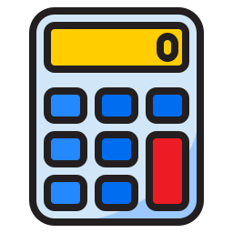
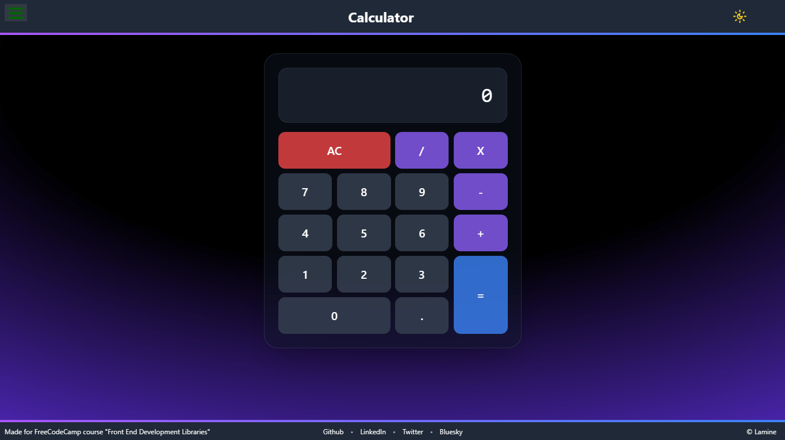

<p align="center">
  <a href="" rel="noopener">
 </a>
</p>

<h3 align="center">md preview X</h3>

<div align="center"  style="display:flex; align-items:center; gap:1rem; flex-wrap:wrap; justify-content:center" >
<div>

[]()

</div>

<div>


</div>

<div>


</div>

<div>


</div>
</div>

---

<div align="center" style="border: 2px solid #ccc; border-radius: 8px; padding: 20px; margin: 20px 0;">

This project was created as part of <strong style="color:#ddffee">**FreeCodeCamp's**</strong> **[Front End Development Libraries](https://www.freecodecamp.org/certification/MohamedLamineF/front-end-development-libraries)** certification. For more details, check out the **[project description](project-description.md)** file.

</div>

## 📝 Table of Contents

- [About](#about)
- [Demo](#demo)
- [Features](#features)
- [Technologies Used](#technologies)
- [Getting Started](#getting_started)
- [Project Structure](#structure)
- [Contributing](#contributing)
- [Other FCC Projects](#others)
- [Authors](#authors)
- [License](#license)

## ℹ️ About <a name = "about"></a>

A simple calculator built with React, TypeScript, and Tailwind CSS. Perform simple calculation operations with a beautiful interface.

## 🎥 Demo <a name = "demo"></a>

<p align="center" >
  <a href="https://ts-fcc-calc.netlify.app/" rel="noopener">
</a>
</p>

## ✨ Features <a name = "features"></a>

- 🔢 Basic arithmetic operations (add, subtract, multiply, divide)
- 🌓 Dark/Light mode with system preference detection
- ✨ Beautiful glassmorphism design
- 💅 Smooth animations and transitions
- ⌨️ Keyboard input support

## 🛠️ Technologies Used <a name="technologies"></a>

- **React v17** (as per FreeCodeCamp requirements)
- **TypeScript** for static typing
- **Tailwind CSS** for styling
- **Vite** for fast development and bundling
- **ESLint** for code linting and quality control
- **Prettier** for code formatting
- **Lucide React** for icons and symbols

## 🏁 Getting Started <a name = "getting_started"></a>

Follow these steps to get a local copy up and running:

### 1. Prerequisites

- Node.js (version 12 or higher)
- npm (usually comes with Node.js)
- Git

### 2. Clone the Repository

```bash
git clone git@github.com:MohamedLamineF/JavaScriptCalculatorFCC.git
```

### 3. Navigate to the Project Directory

```bash
cd JavaScriptCalculatorFCC
```

### 4. Install Dependencies

```bash
npm install
```

### 5. Start the Development Server

```bash
npm run dev
```

## 🌳 Project Structure <a name="structure"></a>

```
src/
├── components/
│ ├── Button.tsx
│ ├── ButtonGrid.tsx
│ ├── Calculator.tsx
│ ├── Display.tsx
│ |── Layout/
│ |   ├── Header.tsx
│ |   └── Footer.tsx
│ └── UI/
│     └── ThemeToggle.tsx
├── handlers/
│ |── digitHandler.ts
│ |── evaluationHandler.ts
│ └── operationsHandler.ts
├── hooks/
│ |── useDarkMode.ts
│ └── useKeyboardInput.tsx
├── reducers/
│ └── calculatorReducer.ts
├── types/
│ └── index.ts
├── utils/
│ |── calculator.ts
│ └── operationsUtils.ts
|── App.tsx
└── main.tsx
```

## 🛠️ Contributing <a name="contributing"></a>

We welcome contributions! If you have ideas for improving this project, please feel free to:

- Open an **issue** to suggest changes or report bugs.
- Submit a **pull request** with your improvements.

## 🎯 Other FCC Projects <a name="others"></a>

Check out my other projects from the FreeCodeCamp Frontend Development Libraries certification:

- [Random DZ Quote Machine](https://github.com/MohamedLamineF/Random-DZ-Quote-Machine)
- [Markdown Previewer](https://github.com/MohamedLamineF/markdown-previewer-FCC)
- [Drum Machine](https://github.com/MohamedLamineF/Drum_machine_FCC)
- [25 + 5 Clock](https://github.com/MohamedLamineF/25-5Clock_FCC)

## ✍️ Authors <a name = "authors"></a>

Made with ❤️ by [Lamine](https://github.com/MohamedLamineF) 😛

# License <a name="license"> </a>

This project is licensed under the MIT License - see the [license](LICENSE) file for details.
